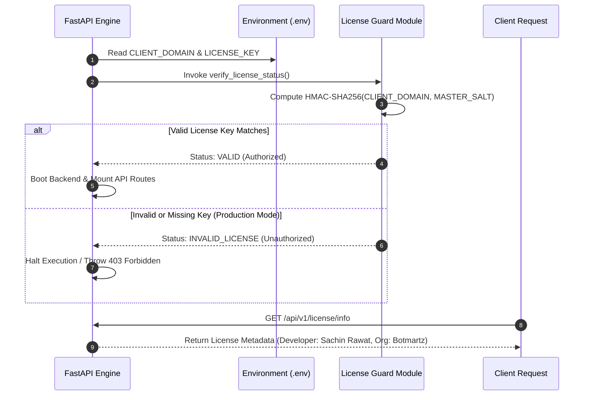

# 🏗️ High-Level Design (HLD) Document
## Skipd Shop — Commercial E-Commerce Engine

| Metadata | Details |
| :--- | :--- |
| **Project Name** | Skipd Shop / E-COM Commerce Engine |
| **Developer** | Sachin Rawat |
| **Organization** | Botmartz AI Solution Pvt Ltd |
| **License Type** | Commercial Single-Tenant EULA |
| **Document Version** | 1.0.0 |
| **Last Updated** | 2026-09-14 |

---

## 📌 1. Executive Summary & Scope
**Skipd Shop** is an enterprise-grade, full-stack B2C e-commerce platform designed for high concurrency, low latency, and modular scalability. The platform comprises a **Next.js 15 (React 19)** storefront running on Turbopack and a **FastAPI** ASGI backend engine powered by **SQLAlchemy 2.0 Async Session**, **Neon Cloud PostgreSQL**, and **Upstash Redis**.

The system features native payment gateway integration (Stripe & Razorpay), automated logistics tracking (Shiprocket), AI-based recommendations, dynamic multi-filter search, and a runtime **Commercial EULA License Guard** protecting IP rights for **Botmartz AI Solution Pvt Ltd**.

---

## 🌐 2. System Architecture Diagram

```mermaid
graph TD
    subgraph Client Tier
        UserBrowser["💻 Customer Web Browser / Mobile App"]
    end

    subgraph Storefront Layer (Frontend)
        NextJS["⚡ Next.js 15 App Router Storefront (Port 3003)\nReact 19 / Tailwind / Lucide Icons"]
    end

    subgraph API Gateway & Security Layer
        FastAPI["🚀 FastAPI ASGI Engine (Port 8080)\nUvicorn / Starlette"]
        LicenseGuard["🛡️ Commercial EULA License Guard\nHMAC SHA-256 Domain Verification"]
        RateLimiter["⚡ Redis Rate Limiter & CORS Guard"]
    end

    subgraph Domain App Micro-Services
        AuthApp["🔐 Auth & Users"]
        CatalogApp["🛍️ Products & Categories"]
        OrderApp["📦 Orders & Cart"]
        PaymentApp["💳 Payments (Stripe/Razorpay)"]
        ShippingApp["🚚 Shipping (Shiprocket)"]
        WalletApp["👛 User Wallet & Rewards"]
        AIApp["🤖 AI Recommendations & Copilot"]
    end

    subgraph Data & Cache Tier
        Postgres[(🐘 Neon Cloud PostgreSQL\nAsync SQLAlchemy 2.0)]
        RedisCache[(⚡ Upstash Redis Cache\nSession & Response Cache)]
    end

    subgraph External Third-Party APIs
        Firebase["🔥 Firebase Auth SDK"]
        StripeSDK["💳 Stripe / Razorpay Gateway"]
        ShiprocketSDK["📦 Shiprocket Logistics API"]
        Cloudinary["🖼️ Cloudinary CDN"]
    end

    UserBrowser -->|HTTPS Requests| NextJS
    NextJS -->|REST API Requests| FastAPI
    FastAPI --> LicenseGuard
    FastAPI --> RateLimiter

    FastAPI --> AuthApp
    FastAPI --> CatalogApp
    FastAPI --> OrderApp
    FastAPI --> PaymentApp
    FastAPI --> ShippingApp
    FastAPI --> WalletApp
    FastAPI --> AIApp

    AuthApp --> Firebase
    PaymentApp --> StripeSDK
    ShippingApp --> ShiprocketSDK
    CatalogApp --> Cloudinary

    AuthApp & CatalogApp & OrderApp & PaymentApp & WalletApp --> Postgres
    FastAPI & RateLimiter --> RedisCache
```

---

## 🧱 3. Subsystem Decomposition & Responsibilities

### **3.1 Storefront Layer (Next.js 15)**
- **Server-Side Rendering (SSR) & PPR**: Optimized page loads for product detail views and category landing pages.
- **Client State Contexts**: `CartContext`, `WishlistContext`, and `AuthProvider` manage real-time UI state.
- **Responsive Aesthetics**: Modern dark/light visual design, glassmorphism UI elements, and sticky checkout bars.

### **3.2 FastAPI ASGI Backend Engine**
- **Async Endpoints**: Non-blocking IO endpoints handling concurrent user sessions.
- **Dependency Injection**: Unified `get_db` session provider and `get_current_user` JWT authentication guards.
- **Pydantic Validation**: Strict runtime request parsing and response model sanitization.

### **3.3 Data & Caching Tier**
- **Neon Cloud PostgreSQL**: Primary relational datastore storing Users, Orders, Products, Cart, and Wallet ledgers.
- **Upstash Redis**: Ultra-fast key-value cache for API response caching, rate limiting, and temporary OTP sessions.

---

## 🔒 4. Commercial Security & Licensing Architecture



---

## 🚀 5. Deployment Topology

| Subsystem | Hosting Platform | URL / Endpoint |
| :--- | :--- | :--- |
| **Frontend Storefront** | Vercel Serverless | `https://ecom.botmartz.com` |
| **Backend API Engine** | Render / VPS | `https://e-com-ecom.onrender.com/api/v1` |
| **Database Server** | Neon Tech PostgreSQL | `ep-still-king-axcdr7h1.aws.neon.tech` |
| **Redis Cache** | Upstash Cloud Redis | `relaxed-beetle-169896.upstash.io:6379` |

---
*Created by Sachin Rawat — Botmartz AI Solution Pvt Ltd*
