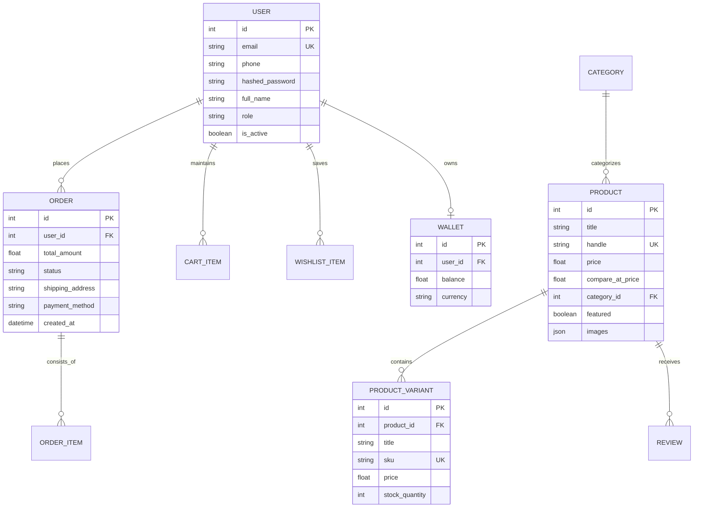

# 🛠️ Low-Level Design (LLD) Document
## Skipd Shop — Commercial E-Commerce Engine

| Metadata | Details |
| :--- | :--- |
| **Project Name** | Skipd Shop / E-COM Commerce Engine |
| **Developer** | Sachin Rawat |
| **Organization** | Botmartz AI Solution Pvt Ltd |
| **License Type** | Commercial Single-Tenant EULA |
| **Document Version** | 1.0.0 |
| **Last Updated** | 2026-09-14 |

---

## 🗄️ 1. Database Entity-Relationship & Schema Design

### **1.1 Entity List & Key Constraints**



---

### **1.2 Detailed Field Specifications**

#### **Table: `users`**
| Column Name | Data Type | Constraints | Description |
| :--- | :--- | :--- | :--- |
| `id` | `INTEGER` | Primary Key, Auto Increment | Unique User ID |
| `email` | `VARCHAR(255)` | Unique, Indexed, Non-Null | Customer Email Address |
| `phone` | `VARCHAR(20)` | Indexed, Nullable | Contact Phone Number |
| `hashed_password` | `VARCHAR(255)` | Non-Null | Bcrypt Hashed Password |
| `full_name` | `VARCHAR(100)` | Non-Null | User's Full Name |
| `role` | `VARCHAR(20)` | Default `'CUSTOMER'` | Role: `CUSTOMER` or `ADMIN` |
| `is_active` | `BOOLEAN` | Default `TRUE` | Account Active Status |

#### **Table: `products`**
| Column Name | Data Type | Constraints | Description |
| :--- | :--- | :--- | :--- |
| `id` | `INTEGER` | Primary Key, Auto Increment | Product Unique ID |
| `title` | `VARCHAR(255)` | Indexed, Non-Null | Product Name |
| `handle` | `VARCHAR(255)` | Unique, Indexed | SEO URL Slug |
| `price` | `FLOAT` | Non-Null | Current Selling Price |
| `compare_at_price` | `FLOAT` | Nullable | Original MRP |
| `category_id` | `INTEGER` | Foreign Key -> `categories.id` | Category Relation |
| `images` | `JSON` | Default `[]` | List of Image URLs |

---

## 💻 2. Core Modules & Function Implementations

### **2.1 Commercial License Guard Module (`app/core/license_guard.py`)**

#### **Key Generation Algorithm:**
$$\text{Signature} = \text{HMAC-SHA256}(\text{MASTER\_SALT}, \text{CleanDomain})[:24]$$
$$\text{LicenseKey} = \text{"SKIPD-LIC-"} + \text{Upper}(\text{Signature})$$

#### **Function Signatures & Logic:**
```python
def generate_valid_license_key(domain: str) -> str:
    """Computes HMAC-SHA256 signature for domain verification."""

def verify_license_status() -> dict:
    """
    1. Fetches CLIENT_DOMAIN & LICENSE_KEY from env.
    2. Compares provided key against generate_valid_license_key(CLIENT_DOMAIN).
    3. Returns dict containing status, developer ("Sachin Rawat"), and organization ("Botmartz AI Solution Pvt Ltd").
    """
```

---

### **2.2 JWT Authentication & Security Module (`app/core/security.py`)**

```python
def create_access_token(data: dict, expires_delta: Optional[timedelta] = None) -> str:
    """Generates signed JWT token with expiry payload."""
    
def verify_password(plain_password: str, hashed_password: str) -> bool:
    """Validates plaintext password against stored bcrypt hash."""
    
def get_password_hash(password: str) -> str:
    """Computes bcrypt hash with default salt rounds."""
```

---

## 🔌 3. API Routing & Endpoint Specifications

### **3.1 Licensing & System Health APIs**
| Endpoint | Method | Auth Required | Description | Response Schema |
| :--- | :--- | :--- | :--- | :--- |
| `/api/v1/license/info` | `GET` | None | Verify Commercial EULA Status | `{"status": "VALID", "developer": "Sachin Rawat", ...}` |
| `/health` | `GET` | None | Engine Health Check | `{"status": "online", "environment": "production"}` |

### **3.2 Auth & User Management APIs**
| Endpoint | Method | Request Payload | Response |
| :--- | :--- | :--- | :--- |
| `/api/v1/auth/login` | `POST` | `{"email": "...", "password": "..."}` | `{"access_token": "...", "token_type": "bearer"}` |
| `/api/v1/auth/firebase-sync` | `POST` | `{"id_token": "..."}` | `{"access_token": "...", "user": {...}}` |

### **3.3 Catalog & Order APIs**
| Endpoint | Method | Request Payload | Response |
| :--- | :--- | :--- | :--- |
| `/api/v1/products` | `GET` | Query Params: `category`, `search`, `page` | `[{"id": 1, "title": "...", "price": 1299.0}]` |
| `/api/v1/orders` | `POST` | `{"items": [...], "address_id": 1}` | `{"order_id": 101, "total": 2499.0, "status": "PENDING"}` |

---

## 🛠️ 4. Exception Handling & HTTP Status Codes

| Status Code | Exception Scenario | Action / Response Payload |
| :--- | :--- | :--- |
| `400 Bad Request` | Invalid payload or missing fields | `{"detail": "Validation Error: Field X missing"}` |
| `401 Unauthorized` | Invalid/expired JWT token | `{"detail": "Could not validate credentials"}` |
| `403 Forbidden` | Invalid License Key or Unauthorized Domain | `{"detail": "Commercial License Verification Failed"}` |
| `404 Not Found` | Requested product/order does not exist | `{"detail": "Item not found"}` |
| `500 Server Error` | Database connection error or unhandled exception | `{"detail": "Internal Server Error"}` |

---
*Created by Sachin Rawat — Botmartz AI Solution Pvt Ltd*
